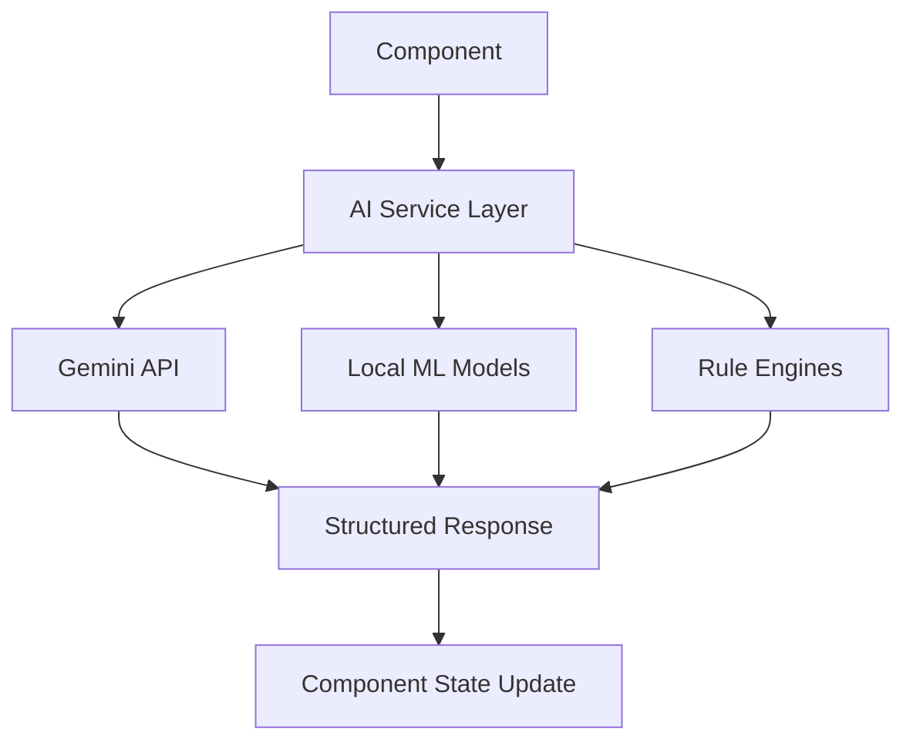
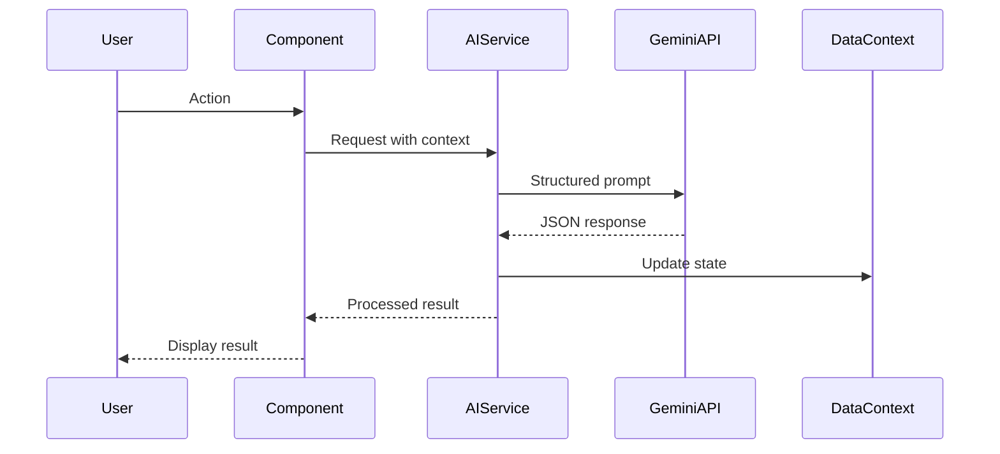

# Arya Hospital System (HMS) - Advanced AI Features Implementation Plan

## Executive Summary

This document outlines a comprehensive plan for implementing 50 advanced AI features across the Arya Hospital System (HMS). Building upon the existing AI infrastructure (AIConsult.tsx and geminiService.ts), these features will transform the platform into an intelligent, predictive healthcare management system.

### Current AI Capabilities
- **Symptom-based differential diagnosis** (AIConsult.tsx)
- **Drug interaction checking** (AIConsult.tsx)
- **Voice-to-text medical scribing** (AIConsult.tsx)
- **Medical image analysis** (AIConsult.tsx - mock implementation)
- **Discharge summary generation** (geminiService.ts)
- **Patient notes analysis** (geminiService.ts)

### Technology Stack
- **AI Engine**: Google Gemini 3 Flash (via @google/genai)
- **Frontend**: React, TypeScript, Tailwind CSS
- **Integration Pattern**: API-based AI calls with structured JSON responses

---

## Feature Categories

### 1. Clinical AI Features (Features 1-15)
*Direct patient care support and clinical decision making*

### 2. Operational AI Features (Features 16-25)
*Hospital operations optimization and automation*

### 3. Administrative AI Features (Features 26-35)
*Business operations, compliance, and reporting*

### 4. Patient-Facing AI Features (Features 36-42)
*Patient engagement and self-service tools*

### 5. Predictive Analytics (Features 43-47)
*Forecasting and risk prediction*

### 6. Medical Imaging AI (Features 48-50)
*Advanced imaging analysis and interpretation*

---

## Detailed Feature Specifications

---

## Category 1: Clinical AI Features

### Feature 1: AI-Powered Triage Assistant
**Description**: Intelligent patient triage system that analyzes symptoms, vital signs, and medical history to assign urgency levels and recommend care pathways.

**Integration Points**:
- [`OPDQueue.tsx`](components/OPDQueue.tsx) - Queue prioritization
- [`PatientManager.tsx`](components/PatientManager.tsx) - Patient intake
- [`types.ts:421-431`](types.ts:421) - QueueItem interface

**Technical Approach**:
- Gemini API call with patient symptoms and vitals
- Structured output: urgency score, recommended department, estimated wait time
- Real-time queue reordering based on AI priority scores

**Priority**: **High** - Critical for emergency department efficiency

---

### Feature 2: Smart Medication Dosage Calculator
**Description**: AI-powered dosage calculator that considers patient weight, age, kidney function, drug interactions, and allergies to recommend optimal dosing.

**Integration Points**:
- [`Pharmacy.tsx`](components/Pharmacy.tsx) - Prescription validation
- [`PatientDetailDrawer.tsx`](components/PatientDetailDrawer.tsx) - Patient context
- [`types.ts:10-14`](types.ts:10) - Medication interface

**Technical Approach**:
- Local calculation engine with AI validation
- Integration with drug database APIs
- Real-time adjustment based on lab results (creatinine clearance)

**Priority**: **High** - Patient safety critical

---

### Feature 3: Clinical Decision Support System (CDSS)
**Description**: Real-time clinical decision support that analyzes patient data against medical guidelines and best practices to provide evidence-based recommendations.

**Integration Points**:
- [`PatientDetailDrawer.tsx`](components/PatientDetailDrawer.tsx) - Patient context
- [`AIConsult.tsx`](components/AIConsult.tsx) - Existing AI infrastructure
- [`LabManagement.tsx`](components/LabManagement.tsx) - Lab result triggers

**Technical Approach**:
- Rule-based engine combined with AI interpretation
- Integration with clinical guidelines database
- Alert system for deviation from best practices

**Priority**: **High** - Core clinical functionality

---

### Feature 4: AI-Enhanced Medical Scribe
**Description**: Advanced voice-to-text system with medical terminology recognition, automatic structuring into SOAP notes, and ICD-10 code suggestion.

**Integration Points**:
- [`AIConsult.tsx:284-325`](components/AIConsult.tsx:284) - Existing scribe module
- [`PatientDetailDrawer.tsx`](components/PatientDetailDrawer.tsx) - Note storage
- [`MedicalCertificates.tsx`](components/MedicalCertificates.tsx) - Documentation

**Technical Approach**:
- Enhanced speech recognition with medical vocabulary
- Gemini API for structuring unstructured text
- Automatic ICD-10/CPT code mapping

**Priority**: **High** - Builds on existing functionality

---

### Feature 5: Intelligent Allergy & Contraindication Alert
**Description**: Proactive alert system that cross-references prescribed medications with patient allergies, conditions, and potential contraindications.

**Integration Points**:
- [`Pharmacy.tsx`](components/Pharmacy.tsx) - Prescription processing
- [`PatientDetailDrawer.tsx`](components/PatientDetailDrawer.tsx) - Allergy data
- [`types.ts:53-69`](types.ts:53) - Patient interface

**Technical Approach**:
- Local rule engine for known allergies
- AI analysis for complex contraindications
- Real-time alerts during prescription entry

**Priority**: **High** - Patient safety critical

---

### Feature 6: AI-Powered Lab Result Interpretation
**Description**: Intelligent analysis of lab results with automatic flagging of abnormalities, trend analysis, and clinical significance interpretation.

**Integration Points**:
- [`LabManagement.tsx`](components/LabManagement.tsx) - Lab results display
- [`PatientDetailDrawer.tsx`](components/PatientDetailDrawer.tsx) - Historical trends
- [`types.ts:23-29`](types.ts:23) - LabResult interface

**Technical Approach**:
- Gemini API for result interpretation
- Historical trend analysis with visualization
- Automatic critical value alerts

**Priority**: **High** - Enhances existing lab module

---

### Feature 7: Smart Treatment Plan Generator
**Description**: AI system that generates personalized treatment plans based on diagnosis, patient history, current medications, and evidence-based guidelines.

**Integration Points**:
- [`AIConsult.tsx`](components/AIConsult.tsx) - Diagnosis integration
- [`PatientDetailDrawer.tsx`](components/PatientDetailDrawer.tsx) - Plan storage
- [`ClinicalResearch.tsx`](components/ClinicalResearch.tsx) - Clinical trials matching

**Technical Approach**:
- Gemini API with structured treatment plan schema
- Integration with clinical guidelines database
- Personalization based on patient factors

**Priority**: **Medium** - Enhances clinical workflow

---

### Feature 8: AI-Powered Differential Diagnosis Engine
**Description**: Enhanced differential diagnosis system that considers rare diseases, local epidemiology, and patient travel history.

**Integration Points**:
- [`AIConsult.tsx:169-226`](components/AIConsult.tsx:169) - Existing diagnosis module
- [`PatientDetailDrawer.tsx`](components/PatientDetailDrawer.tsx) - Patient context
- [`types.ts:53-69`](types.ts:53) - Patient interface

**Technical Approach**:
- Enhanced Gemini prompts with epidemiological data
- Rare disease database integration
- Confidence scoring with explanation

**Priority**: **High** - Core diagnostic functionality

---

### Feature 9: Intelligent Vital Signs Monitoring
**Description**: AI analysis of vital signs trends to detect early deterioration, sepsis risk, and other clinical warnings before they become critical.

**Integration Points**:
- [`PatientDetailDrawer.tsx`](components/PatientDetailDrawer.tsx) - Vitals display
- [`BedManagement.tsx`](components/BedManagement.tsx) - ICU monitoring
- [`types.ts:16-21`](types.ts:16) - VitalSign interface

**Technical Approach**:
- Real-time streaming analysis
- Early warning score calculation (MEWS, NEWS2)
- Predictive deterioration alerts

**Priority**: **High** - Critical care support

---

### Feature 10: AI-Powered Clinical Documentation Quality Checker
**Description**: System that reviews clinical documentation for completeness, accuracy, and compliance with coding requirements.

**Integration Points**:
- [`PatientDetailDrawer.tsx`](components/PatientDetailDrawer.tsx) - Documentation
- [`MedicalCertificates.tsx`](components/MedicalCertificates.tsx) - Certificates
- [`Billing.tsx`](components/Billing.tsx) - Coding compliance

**Technical Approach**:
- Gemini API for documentation analysis
- Compliance rule engine
- Suggested improvements display

**Priority**: **Medium** - Revenue optimization

---

### Feature 11: Smart Order Set Recommendations
**Description**: AI-powered suggestion of appropriate order sets (labs, imaging, medications) based on diagnosis and patient presentation.

**Integration Points**:
- [`OPDQueue.tsx`](components/OPDQueue.tsx) - Order entry
- [`LabManagement.tsx`](components/LabManagement.tsx) - Lab orders
- [`Radiology.tsx`](components/Radiology.tsx) - Imaging orders

**Technical Approach**:
- Diagnosis-to-order-set mapping
- AI customization for patient factors
- One-click order set application

**Priority**: **Medium** - Workflow efficiency

---

### Feature 12: AI-Powered Antimicrobial Stewardship
**Description**: Intelligent system that recommends appropriate antibiotic therapy, duration, and flags potential antimicrobial resistance issues.

**Integration Points**:
- [`Pharmacy.tsx`](components/Pharmacy.tsx) - Antibiotic prescriptions
- [`LabManagement.tsx`](components/LabManagement.tsx) - Culture results
- [`ClinicalResearch.tsx`](components/ClinicalResearch.tsx) - Resistance patterns

**Technical Approach**:
- Local antibiogram data integration
- AI recommendation engine
- Duration and de-escalation prompts

**Priority**: **High** - Critical for patient safety and resistance management

---

### Feature 13: Intelligent Pain Management Advisor
**Description**: AI system that recommends multimodal pain management approaches based on patient history, conditions, and risk factors.

**Integration Points**:
- [`PatientDetailDrawer.tsx`](components/PatientDetailDrawer.tsx) - Pain scores
- [`Pharmacy.tsx`](components/Pharmacy.tsx) - Analgesic orders
- [`Physiotherapy.tsx`](components/Physiotherapy.tsx) - Non-pharmacological options

**Technical Approach**:
- Gemini API for personalized recommendations
- Opioid risk assessment integration
- Multimodal approach suggestions

**Priority**: **Medium** - Pain management optimization

---

### Feature 14: AI-Powered Nutrition Support Recommendations
**Description**: Intelligent nutritional assessment and recommendation system for hospitalized patients, including TPN calculations.

**Integration Points**:
- [`DietaryKitchen.tsx`](components/DietaryKitchen.tsx) - Diet orders
- [`PatientDetailDrawer.tsx`](components/PatientDetailDrawer.tsx) - Nutritional status
- [`types.ts:39-44`](types.ts:39) - DietItem interface

**Technical Approach**:
- AI nutritional needs calculation
- Integration with dietary restrictions
- TPN/enteral feeding recommendations

**Priority**: **Medium** - Nutritional support

---

### Feature 15: Smart Discharge Planning Assistant
**Description**: AI system that identifies discharge barriers, coordinates post-discharge care, and generates comprehensive discharge instructions.

**Integration Points**:
- [`AIConsult.tsx:378-420`](components/AIConsult.tsx:378) - Existing discharge module
- [`PatientDetailDrawer.tsx`](components/PatientDetailDrawer.tsx) - Patient status
- [`ReferralSystem.tsx`](components/ReferralSystem.tsx) - Post-discharge referrals

**Technical Approach**:
- Discharge readiness scoring
- Barrier identification algorithm
- Automated instruction generation

**Priority**: **High** - Reduces readmissions

---

## Category 2: Operational AI Features

### Feature 16: AI-Powered Bed Management Optimizer
**Description**: Intelligent bed allocation system that optimizes patient placement based on acuity, infection status, and predicted length of stay.

**Integration Points**:
- [`BedManagement.tsx`](components/BedManagement.tsx) - Bed assignment
- [`PatientManager.tsx`](components/PatientManager.tsx) - Admission
- [`types.ts:91-98`](types.ts:91) - Bed interface

**Technical Approach**:
- Optimization algorithm with AI prediction
- Real-time capacity management
- Infection control consideration

**Priority**: **High** - Critical for hospital flow

---

### Feature 17: Intelligent Operating Room Scheduler
**Description**: AI-powered OR scheduling that optimizes room utilization, predicts case duration, and coordinates staff and equipment.

**Integration Points**:
- [`OTManagement.tsx`](components/OTManagement.tsx) - OR scheduling
- [`Schedule.tsx`](components/Schedule.tsx) - Staff scheduling
- [`types.ts:160-167`](types.ts:160) - OTStatus interface

**Technical Approach**:
- Case duration prediction model
- Resource optimization algorithm
- Real-time schedule adjustment

**Priority**: **High** - OR efficiency critical

---

### Feature 18: AI-Powered Staff Shift Optimization
**Description**: Intelligent shift scheduling that balances workload, considers staff preferences, and predicts staffing needs based on patient volume.

**Integration Points**:
- [`ShiftRoster.tsx`](components/ShiftRoster.tsx) - Shift management
- [`Schedule.tsx`](components/Schedule.tsx) - Scheduling
- [`types.ts:178-185`](types.ts:178) - Shift interface

**Technical Approach**:
- Predictive staffing model
- Optimization algorithm
- Preference-weighted scheduling

**Priority**: **Medium** - Staff satisfaction and efficiency

---

### Feature 19: Smart Inventory Forecasting
**Description**: AI-powered inventory management that predicts supply needs, identifies potential shortages, and automates reordering.

**Integration Points**:
- [`Pharmacy.tsx`](components/Pharmacy.tsx) - Medication inventory
- [`Procurement.tsx`](components/Procurement.tsx) - Supply chain
- [`AssetManager.tsx`](components/AssetManager.tsx) - Equipment tracking

**Technical Approach**:
- Time-series forecasting model
- Usage pattern analysis
- Automated reorder triggers

**Priority**: **High** - Supply chain efficiency

---

### Feature 20: AI-Powered Equipment Maintenance Predictor
**Description**: Predictive maintenance system that anticipates equipment failures and schedules preventive maintenance.

**Integration Points**:
- [`AssetManager.tsx`](components/AssetManager.tsx) - Equipment management
- [`FacilityMaintenance.tsx`](components/FacilityMaintenance.tsx) - Maintenance
- [`CSSD.tsx`](components/CSSD.tsx) - Sterilization equipment

**Technical Approach**:
- IoT sensor integration (future)
- Usage-based prediction model
- Maintenance scheduling optimization

**Priority**: **Medium** - Equipment reliability

---

### Feature 21: Intelligent Patient Flow Analytics
**Description**: Real-time analysis of patient movement through the hospital with bottleneck identification and flow optimization suggestions.

**Integration Points**:
- [`Dashboard.tsx`](components/Dashboard.tsx) - Flow visualization
- [`OPDQueue.tsx`](components/OPDQueue.tsx) - Queue management
- [`InternalTransport.tsx`](components/InternalTransport.tsx) - Patient transport

**Technical Approach**:
- Real-time flow tracking
- Bottleneck detection algorithm
- Optimization recommendations

**Priority**: **High** - Hospital efficiency

---

### Feature 22: AI-Powered Housekeeping Optimization
**Description**: Intelligent housekeeping scheduling that prioritizes rooms based on discharge predictions and infection control needs.

**Integration Points**:
- [`Housekeeping.tsx`](components/Housekeeping.tsx) - Task management
- [`BedManagement.tsx`](components/BedManagement.tsx) - Room status
- [`types.ts:204-210`](types.ts:204) - HousekeepingTask interface

**Technical Approach**:
- Discharge prediction integration
- Priority scoring algorithm
- Route optimization

**Priority**: **Medium** - Turnaround efficiency

---

### Feature 23: Smart Ambulance Dispatch System
**Description**: AI-powered emergency dispatch that optimizes ambulance positioning and routing based on demand patterns and traffic.

**Integration Points**:
- [`AmbulanceManager.tsx`](components/AmbulanceManager.tsx) - Fleet management
- [`CallCenter.tsx`](components/CallCenter.tsx) - Emergency calls
- [`types.ts:119-126`](types.ts:119) - Ambulance interface

**Technical Approach**:
- Demand prediction model
- Real-time routing optimization
- Resource positioning algorithm

**Priority**: **High** - Emergency response

---

### Feature 24: AI-Powered Waste Management Compliance
**Description**: Intelligent monitoring of medical waste disposal with compliance tracking and optimization recommendations.

**Integration Points**:
- [`WasteManagement.tsx`](components/WasteManagement.tsx) - Waste tracking
- [`types.ts:331-337`](types.ts:331) - WasteRecord interface
- [`Compliance reporting`](components/AuditLogs.tsx)

**Technical Approach**:
- AI classification assistance
- Compliance monitoring
- Optimization suggestions

**Priority**: **Low** - Regulatory compliance

---

### Feature 25: Intelligent Energy Management
**Description**: AI system that optimizes hospital energy consumption based on occupancy, weather, and operational patterns.

**Integration Points**:
- [`FacilityMaintenance.tsx`](components/FacilityMaintenance.tsx) - Facility systems
- [`Dashboard.tsx`](components/Dashboard.tsx) - Energy metrics
- [`Settings.tsx`](components/Settings.tsx) - System configuration

**Technical Approach**:
- Predictive consumption model
- Optimization algorithm
- Automated HVAC control (future)

**Priority**: **Low** - Cost savings

---

## Category 3: Administrative AI Features

### Feature 26: AI-Powered Medical Coding Assistant
**Description**: Intelligent coding system that suggests ICD-10, CPT, and HCPCS codes based on clinical documentation.

**Integration Points**:
- [`Billing.tsx`](components/Billing.tsx) - Billing workflow
- [`InsuranceClaims.tsx`](components/InsuranceClaims.tsx) - Claims processing
- [`PatientDetailDrawer.tsx`](components/PatientDetailDrawer.tsx) - Documentation

**Technical Approach**:
- Gemini API for code suggestion
- NLP-based documentation analysis
- Coding rule validation

**Priority**: **High** - Revenue cycle optimization

---

### Feature 27: Intelligent Claims Denial Predictor
**Description**: AI system that predicts claim denial risk and suggests documentation improvements before submission.

**Integration Points**:
- [`InsuranceClaims.tsx`](components/InsuranceClaims.tsx) - Claims workflow
- [`Billing.tsx`](components/Billing.tsx) - Billing
- [`types.ts:187-194`](types.ts:187) - InsuranceClaim interface

**Technical Approach**:
- Historical denial pattern analysis
- Pre-submission validation
- Documentation gap identification

**Priority**: **High** - Revenue protection

---

### Feature 28: AI-Powered Revenue Cycle Analytics
**Description**: Comprehensive revenue analysis with AI insights into revenue leakage, optimization opportunities, and financial forecasting.

**Integration Points**:
- [`Revenue.tsx`](components/Revenue.tsx) - Revenue tracking
- [`Billing.tsx`](components/Billing.tsx) - Billing data
- [`Dashboard.tsx`](components/Dashboard.tsx) - Financial KPIs

**Technical Approach**:
- AI-powered anomaly detection
- Trend analysis and forecasting
- Optimization recommendations

**Priority**: **High** - Financial performance

---

### Feature 29: Smart Compliance Monitoring System
**Description**: AI-powered compliance monitoring that identifies potential regulatory issues and tracks compliance metrics.

**Integration Points**:
- [`AuditLogs.tsx`](components/AuditLogs.tsx) - Audit tracking
- [`SecurityMonitor.tsx`](components/SecurityMonitor.tsx) - Security compliance
- [`Legal.tsx`](components/Legal.tsx) - Legal compliance

**Technical Approach**:
- Regulatory rule engine
- AI compliance analysis
- Automated audit trail

**Priority**: **High** - Regulatory compliance

---

### Feature 30: AI-Powered Fraud Detection System
**Description**: Intelligent system that detects potential billing fraud, identity theft, and suspicious patterns in healthcare transactions.

**Integration Points**:
- [`Billing.tsx`](components/Billing.tsx) - Transaction monitoring
- [`InsuranceClaims.tsx`](components/InsuranceClaims.tsx) - Claims analysis
- [`SecurityMonitor.tsx`](components/SecurityMonitor.tsx) - Security alerts

**Technical Approach**:
- Anomaly detection algorithms
- Pattern recognition
- Real-time alert system

**Priority**: **High** - Financial protection

---

### Feature 31: Intelligent Report Generation
**Description**: AI-powered report generation that creates comprehensive reports from hospital data with natural language insights.

**Integration Points**:
- [`Analytics.tsx`](components/Analytics.tsx) - Analytics dashboard
- [`Dashboard.tsx`](components/Dashboard.tsx) - Data aggregation
- All reporting components

**Technical Approach**:
- Gemini API for narrative generation
- Automated data visualization
- Scheduled report generation

**Priority**: **Medium** - Administrative efficiency

---

### Feature 32: AI-Powered Budget Forecasting
**Description**: Intelligent budget planning system that predicts expenses, revenue, and resource needs based on historical patterns and trends.

**Integration Points**:
- [`Expenses.tsx`](components/Expenses.tsx) - Expense tracking
- [`Revenue.tsx`](components/Revenue.tsx) - Revenue data
- [`Procurement.tsx`](components/Procurement.tsx) - Purchasing

**Technical Approach**:
- Time-series forecasting
- Scenario modeling
- Variance analysis

**Priority**: **Medium** - Financial planning

---

### Feature 33: Smart Vendor Evaluation System
**Description**: AI-powered vendor analysis that evaluates performance, pricing, and reliability to support procurement decisions.

**Integration Points**:
- [`Procurement.tsx`](components/Procurement.tsx) - Vendor management
- [`AssetManager.tsx`](components/AssetManager.tsx) - Equipment data
- [`types.ts:262-269`](types.ts:262) - ProcurementItem interface

**Technical Approach**:
- Multi-criteria decision analysis
- Performance scoring algorithm
- Recommendation engine

**Priority**: **Low** - Procurement optimization

---

### Feature 34: AI-Powered HR Analytics
**Description**: Intelligent HR system that analyzes staff performance, predicts turnover, and identifies training needs.

**Integration Points**:
- [`StaffDirectory.tsx`](components/StaffDirectory.tsx) - Staff data
- [`Recruitment.tsx`](components/Recruitment.tsx) - Hiring
- [`StaffTraining.tsx`](components/StaffTraining.tsx) - Training

**Technical Approach**:
- Performance prediction model
- Turnover risk analysis
- Training gap identification

**Priority**: **Medium** - Workforce management

---

### Feature 35: Intelligent Contract Management
**Description**: AI system that manages contracts, identifies renewal dates, and flags potential issues in contract terms.

**Integration Points**:
- [`Legal.tsx`](components/Legal.tsx) - Legal documents
- [`Procurement.tsx`](components/Procurement.tsx) - Vendor contracts
- [`Settings.tsx`](components/Settings.tsx) - System configuration

**Technical Approach**:
- NLP contract analysis
- Renewal prediction
- Risk identification

**Priority**: **Low** - Administrative support

---

## Category 4: Patient-Facing AI Features

### Feature 36: AI Health Chatbot
**Description**: Intelligent chatbot for patient inquiries, appointment scheduling, and general health information.

**Integration Points**:
- [`ChatWidget.tsx`](components/ChatWidget.tsx) - Existing chat widget
- [`HelpDesk.tsx`](components/HelpDesk.tsx) - Patient support
- [`Telemedicine.tsx`](components/Telemedicine.tsx) - Virtual care

**Technical Approach**:
- Gemini API for natural language understanding
- Intent classification
- Integration with hospital systems

**Priority**: **High** - Patient engagement

---

### Feature 37: AI-Powered Symptom Checker (Patient Portal)
**Description**: Patient-facing symptom assessment tool that provides triage recommendations and appointment suggestions.

**Integration Points**:
- [`AIConsult.tsx`](components/AIConsult.tsx) - Adapted for patient use
- [`OPDQueue.tsx`](components/OPDQueue.tsx) - Appointment booking
- [`Telemedicine.tsx`](components/Telemedicine.tsx) - Virtual consultation

**Technical Approach**:
- Simplified patient-facing interface
- Safe triage recommendations
- Integration with appointment system

**Priority**: **High** - Patient self-service

---

### Feature 38: Intelligent Appointment Scheduling Assistant
**Description**: AI-powered scheduling that finds optimal appointment slots based on patient preferences, provider availability, and urgency.

**Integration Points**:
- [`Schedule.tsx`](components/Schedule.tsx) - Scheduling system
- [`OPDQueue.tsx`](components/OPDQueue.tsx) - Queue management
- [`Telemedicine.tsx`](components/Telemedicine.tsx) - Virtual visits

**Technical Approach**:
- Optimization algorithm
- Preference learning
- Wait time prediction

**Priority**: **High** - Patient convenience

---

### Feature 39: AI-Powered Medication Reminder System
**Description**: Intelligent medication adherence system with personalized reminders and interaction warnings.

**Integration Points**:
- [`Pharmacy.tsx`](components/Pharmacy.tsx) - Prescription data
- [`PatientDetailDrawer.tsx`](components/PatientDetailDrawer.tsx) - Medication list
- Mobile app integration (future)

**Technical Approach**:
- Smart reminder scheduling
- Adherence tracking
- Intervention triggers

**Priority**: **Medium** - Patient compliance

---

### Feature 40: Intelligent Patient Education Generator
**Description**: AI system that generates personalized patient education materials based on diagnosis, treatment plan, and health literacy level.

**Integration Points**:
- [`PatientDetailDrawer.tsx`](components/PatientDetailDrawer.tsx) - Patient context
- [`AIConsult.tsx`](components/AIConsult.tsx) - Diagnosis data
- [`Discharge planning`](components/AIConsult.tsx:378)

**Technical Approach**:
- Gemini API for content generation
- Health literacy adaptation
- Multi-language support

**Priority**: **Medium** - Patient engagement

---

### Feature 41: AI-Powered Post-Discharge Follow-Up System
**Description**: Intelligent follow-up system that monitors patient recovery, schedules check-ins, and identifies complications early.

**Integration Points**:
- [`Telemedicine.tsx`](components/Telemedicine.tsx) - Follow-up visits
- [`PatientDetailDrawer.tsx`](components/PatientDetailDrawer.tsx) - Discharge data
- [`FeedbackSystem.tsx`](components/FeedbackSystem.tsx) - Patient feedback

**Technical Approach**:
- Risk-stratified follow-up scheduling
- Automated check-in messages
- Alert system for complications

**Priority**: **High** - Readmission reduction

---

### Feature 42: Smart Patient Portal Search
**Description**: AI-powered search functionality that helps patients find relevant information, services, and records.

**Integration Points**:
- All patient-facing components
- [`HelpDesk.tsx`](components/HelpDesk.tsx) - Information desk
- [`NoticeBoard.tsx`](components/NoticeBoard.tsx) - Announcements

**Technical Approach**:
- Semantic search implementation
- Intent understanding
- Personalized results

**Priority**: **Medium** - Patient experience

---

## Category 5: Predictive Analytics

### Feature 43: Patient Readmission Risk Predictor
**Description**: AI model that predicts 30-day readmission risk for discharged patients, enabling targeted interventions.

**Integration Points**:
- [`PatientDetailDrawer.tsx`](components/PatientDetailDrawer.tsx) - Patient data
- [`Dashboard.tsx`](components/Dashboard.tsx) - Risk dashboard
- [`Discharge planning`](components/AIConsult.tsx:378)

**Technical Approach**:
- Machine learning risk model
- LACE index integration
- Intervention recommendation

**Priority**: **High** - Quality metrics

---

### Feature 44: AI-Powered Disease Outbreak Detection
**Description**: Surveillance system that detects potential disease outbreaks through pattern analysis of patient presentations.

**Integration Points**:
- [`Dashboard.tsx`](components/Dashboard.tsx) - Surveillance dashboard
- [`OPDQueue.tsx`](components/OPDQueue.tsx) - Symptom tracking
- [`LabManagement.tsx`](components/LabManagement.tsx) - Lab patterns

**Technical Approach**:
- Anomaly detection algorithms
- Geographic clustering analysis
- Alert system integration

**Priority**: **High** - Public health

---

### Feature 45: Patient Length of Stay Predictor
**Description**: AI model that predicts patient length of stay, enabling proactive discharge planning and bed management.

**Integration Points**:
- [`BedManagement.tsx`](components/BedManagement.tsx) - Capacity planning
- [`PatientDetailDrawer.tsx`](components/PatientDetailDrawer.tsx) - Patient data
- [`Dashboard.tsx`](components/Dashboard.tsx) - Predictions display

**Technical Approach**:
- Regression model with clinical features
- Daily prediction updates
- Discharge planning integration

**Priority**: **High** - Capacity management

---

### Feature 46: AI-Powered Mortality Risk Assessment
**Description**: Real-time mortality risk scoring for ICU and high-acuity patients to guide care intensity and family discussions.

**Integration Points**:
- [`BedManagement.tsx`](components/BedManagement.tsx) - ICU patients
- [`PatientDetailDrawer.tsx`](components/PatientDetailDrawer.tsx) - Clinical data
- [`Mortuary.tsx`](components/Mortuary.tsx) - End-of-life planning

**Technical Approach**:
- APACHE II/III integration
- AI-enhanced prediction
- Trend monitoring

**Priority**: **High** - Critical care

---

### Feature 47: Intelligent Patient Volume Forecasting
**Description**: AI system that predicts patient volumes for ED, OPD, and inpatient services to support staffing and resource planning.

**Integration Points**:
- [`Dashboard.tsx`](components/Dashboard.tsx) - Volume predictions
- [`ShiftRoster.tsx`](components/ShiftRoster.tsx) - Staffing decisions
- [`OPDQueue.tsx`](components/OPDQueue.tsx) - Queue management

**Technical Approach**:
- Time-series forecasting
- Seasonal pattern analysis
- Event-based adjustments

**Priority**: **High** - Resource planning

---

## Category 6: Medical Imaging AI

### Feature 48: AI-Powered Chest X-Ray Analysis
**Description**: Automated chest X-ray interpretation for detection of pneumonia, effusion, cardiomegaly, and other common findings.

**Integration Points**:
- [`Radiology.tsx`](components/Radiology.tsx) - Imaging workflow
- [`AIConsult.tsx:328-376`](components/AIConsult.tsx:328) - Existing radiology AI
- [`types.ts:253-260`](types.ts:253) - RadiologyRequest interface

**Technical Approach**:
- Deep learning model integration
- DICOM processing
- Structured findings report

**Priority**: **High** - Diagnostic support

---

### Feature 49: AI-Powered CT Scan Analysis
**Description**: Automated CT scan interpretation for stroke, hemorrhage, tumor detection, and other critical findings.

**Integration Points**:
- [`Radiology.tsx`](components/Radiology.tsx) - CT workflow
- [`OTManagement.tsx`](components/OTManagement.tsx) - Surgical planning
- [`Emergency response`](components/AmbulanceManager.tsx)

**Technical Approach**:
- Specialized CT analysis models
- Priority triage for critical findings
- 3D visualization integration

**Priority**: **High** - Critical diagnostics

---

### Feature 50: AI-Powered Ultrasound Analysis
**Description**: Automated ultrasound interpretation for obstetric, cardiac, and abdominal applications.

**Integration Points**:
- [`Radiology.tsx`](components/Radiology.tsx) - Ultrasound workflow
- [`Maternity.tsx`](components/Maternity.tsx) - Obstetric imaging
- [`types.ts:366-373`](types.ts:366) - MaternityPatient interface

**Technical Approach**:
- Specialized ultrasound models
- Fetal measurement automation
- Cardiac function analysis

**Priority**: **Medium** - Diagnostic support

---

## Implementation Roadmap

### Phase 1: Foundation (High Priority Clinical Features)
1. AI-Powered Triage Assistant
2. Smart Medication Dosage Calculator
3. Clinical Decision Support System
4. AI-Enhanced Medical Scribe
5. Intelligent Allergy & Contraindication Alert
6. AI-Powered Lab Result Interpretation
7. AI-Powered Differential Diagnosis Engine
8. Intelligent Vital Signs Monitoring
9. AI-Powered Antimicrobial Stewardship
10. Smart Discharge Planning Assistant

### Phase 2: Operations & Efficiency
11. AI-Powered Bed Management Optimizer
12. Intelligent Operating Room Scheduler
13. Smart Inventory Forecasting
14. Intelligent Patient Flow Analytics
15. Smart Ambulance Dispatch System

### Phase 3: Revenue & Compliance
16. AI-Powered Medical Coding Assistant
17. Intelligent Claims Denial Predictor
18. AI-Powered Revenue Cycle Analytics
19. Smart Compliance Monitoring System
20. AI-Powered Fraud Detection System

### Phase 4: Patient Engagement
21. AI Health Chatbot
22. AI-Powered Symptom Checker (Patient Portal)
23. Intelligent Appointment Scheduling Assistant
24. AI-Powered Post-Discharge Follow-Up System

### Phase 5: Predictive Analytics
25. Patient Readmission Risk Predictor
26. AI-Powered Disease Outbreak Detection
27. Patient Length of Stay Predictor
28. AI-Powered Mortality Risk Assessment
29. Intelligent Patient Volume Forecasting

### Phase 6: Advanced Imaging
30. AI-Powered Chest X-Ray Analysis
31. AI-Powered CT Scan Analysis
32. AI-Powered Ultrasound Analysis

### Phase 7: Remaining Features
33. All Medium and Low priority features

---

## Technical Architecture

### AI Service Layer

```
src/services/
  ai/
    clinicalAI.ts       # Clinical decision support
    operationalAI.ts    # Operations optimization
    predictiveAI.ts     # Predictive models
    imagingAI.ts        # Medical imaging analysis
    patientAI.ts        # Patient-facing features
    baseAIService.ts    # Shared Gemini integration
```

### Integration Pattern



### Data Flow



---

## API Integration Specifications

### Gemini API Configuration

```typescript
interface AIRequestConfig {
  model: 'gemini-3-flash-preview' | 'gemini-pro';
  temperature: number; // 0.0 - 1.0
  maxTokens: number;
  responseSchema: object;
}
```

### Standard Response Schema

```typescript
interface AIResponse {
  success: boolean;
  data: unknown;
  confidence?: number;
  reasoning?: string;
  warnings?: string[];
  alternatives?: unknown[];
}
```

---

## Risk Mitigation

### Clinical Safety
- All AI recommendations require human verification
- Clear confidence scores displayed
- Audit trail for all AI-assisted decisions
- Fallback to manual processes

### Data Privacy
- HIPAA-compliant data handling
- No PHI sent to external APIs without anonymization
- Local processing where possible
- Encryption in transit and at rest

### Model Reliability
- Regular model validation
- Performance monitoring
- Version control for AI models
- Rollback capabilities

---

## Success Metrics

### Clinical Outcomes
- Reduction in diagnostic errors
- Improvement in patient outcomes
- Decrease in adverse drug events
- Faster time to diagnosis

### Operational Efficiency
- Reduced patient wait times
- Improved bed utilization
- Decreased length of stay
- Lower operational costs

### Financial Impact
- Reduced claim denials
- Improved revenue capture
- Decreased compliance penalties
- Better resource allocation

### Patient Satisfaction
- Higher patient satisfaction scores
- Improved engagement metrics
- Better communication ratings
- Increased portal usage

---

## Conclusion

This comprehensive AI feature plan transforms Arya Hospital System (HMS) into an intelligent healthcare platform. The phased implementation approach ensures that high-priority clinical and operational features are delivered first, providing immediate value while building toward a fully AI-integrated hospital management system.

The existing infrastructure in [`AIConsult.tsx`](components/AIConsult.tsx) and [`geminiService.ts`](services/geminiService.ts) provides a solid foundation for expansion. The modular architecture allows for incremental implementation without disrupting existing functionality.

---

*Document Version: 1.0*
*Created: February 2026*
*Author: Architecture Team*