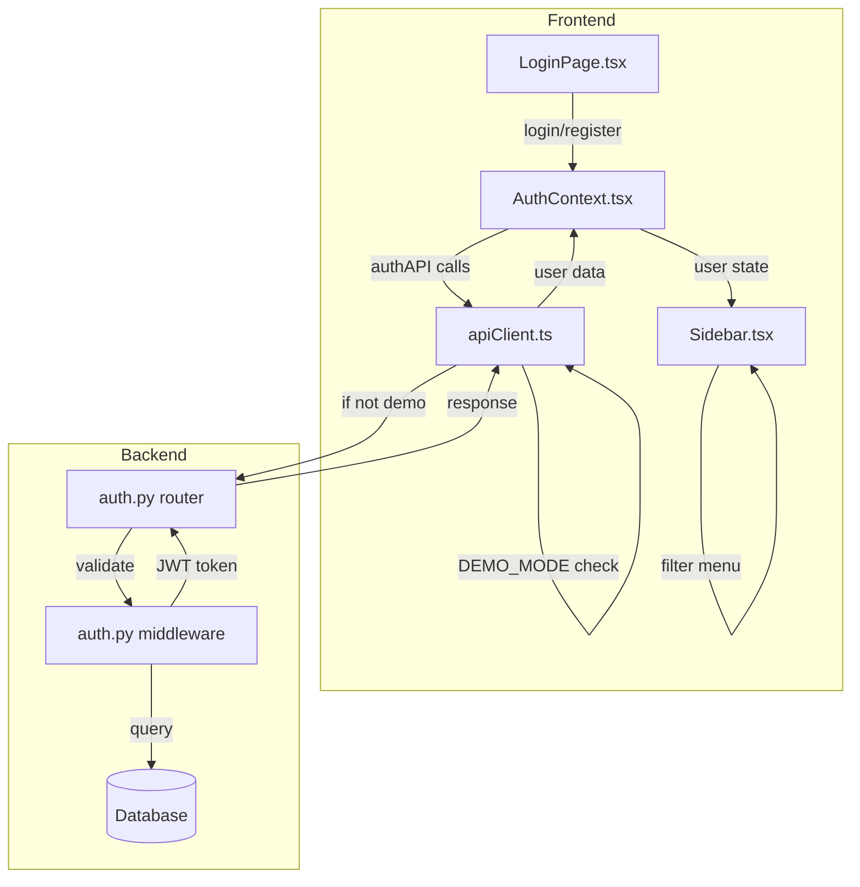
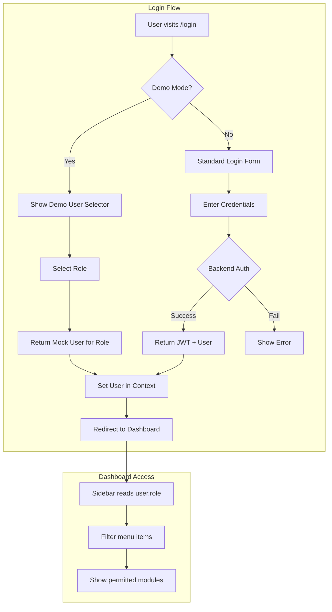

# Authentication System and Demo Mode Analysis

## Executive Summary

This document provides a comprehensive analysis of the NexusHealth HMS authentication system and identifies issues preventing the demo mode from properly allowing access to all role-based dashboards.

---

## 1. Authentication Architecture Overview

### 1.1 System Components



### 1.2 Authentication Flow

1. **User Login Request** → [`LoginPage.tsx`](components/LoginPage.tsx:19) captures email, password, and role
2. **AuthContext Processing** → [`AuthContext.tsx`](src/contexts/AuthContext.tsx:64) calls `authAPI.login()`
3. **API Client Routing** → [`apiClient.ts`](services/apiClient.ts:38) checks `DEMO_MODE` flag
4. **Response Handling** → User data stored in context, token in localStorage

---

## 2. Current Implementation Details

### 2.1 Frontend Login Component

**File:** [`components/LoginPage.tsx`](components/LoginPage.tsx:1)

```typescript
// Key state variables
const [name, setName] = useState('');
const [email, setEmail] = useState('');
const [password, setPassword] = useState('');
const [role, setRole] = useState<UserRole>(UserRole.ADMIN);

// Login handler
const handleSubmit = async (e: React.FormEvent) => {
  if (view === 'login') {
    await login(email, password);  // Role is NOT passed to login!
  } else if (view === 'register') {
    await register(name, email, password, role);  // Role IS passed to register
  }
};
```

**Issue:** The `role` selection is only used during registration, not login. In demo mode, this creates a disconnect between what the user selects and what they receive.

### 2.2 Authentication Context

**File:** [`src/contexts/AuthContext.tsx`](src/contexts/AuthContext.tsx:1)

```typescript
const login = async (email: string, password: string) => {
  const { access_token, user } = await authAPI.login({ email, password });
  setToken(access_token);
  setUser(user);
  // ... login history tracking
};

const register = async (name: string, email: string, password: string, role: string) => {
  const { access_token, user } = await authAPI.register({ name, email, password, role });
  setToken(access_token);
  setUser(user);
};
```

### 2.3 API Client - Demo Mode Implementation

**File:** [`services/apiClient.ts`](services/apiClient.ts:1)

```typescript
// Demo mode is enabled by default
const DEMO_MODE = import.meta.env.VITE_USE_MOCK !== 'false';

// Mock login handler - ALWAYS returns first mock user
if (endpoint === '/auth/login') 
  return resolve({ 
    access_token: 'mock-jwt-token', 
    user: Mocks.MOCK_USERS[0]  // ⚠️ Always Admin User!
  } as any);

// Mock register handler - ALSO returns first mock user
if (endpoint === '/auth/register') 
  return resolve({ 
    access_token: 'mock-jwt-token', 
    user: Mocks.MOCK_USERS[0]  // ⚠️ Always Admin User!
  } as any);
```

**Critical Issue:** The mock handlers always return `MOCK_USERS[0]` (Admin User), completely ignoring the selected role.

### 2.4 Mock User Data

**File:** [`services/mockData.ts`](services/mockData.ts:7)

```typescript
export const MOCK_USERS: User[] = [
    {
        id: "admin-001",
        name: "Admin User",
        role: UserRole.ADMIN,
        avatar: "https://ui-avatars.com/api/?name=Admin&background=0D9488&color=fff"
    },
    {
        id: "doc-001",
        name: "Dr. Sarah Chen",
        role: UserRole.DOCTOR,
        avatar: "https://ui-avatars.com/api/?name=Sarah+Chen&background=0D9488&color=fff"
    }
];
```

**Issue:** Only 2 mock users exist (Admin and Doctor), missing 12 other role types.

---

## 3. Role-Based Dashboard System

### 3.1 Defined User Roles

**File:** [`types.ts`](types.ts:784)

| Role | Value | Dashboard Access Level |
|------|-------|----------------------|
| `ADMIN` | Admin | Full access to all modules |
| `DOCTOR` | Doctor | Clinical modules |
| `NURSE` | Nurse | Patient care modules |
| `PHARMACIST` | Pharmacist | Pharmacy modules |
| `RECEPTIONIST` | Receptionist | Front desk modules |
| `LAB_TECHNICIAN` | Lab Technician | Lab modules |
| `RADIOLOGIST` | Radiologist | Radiology modules |
| `ACCOUNTANT` | Accountant | Finance modules |
| `HR_MANAGER` | HR Manager | HR modules |
| `FACILITY_MANAGER` | Facility Manager | Facility modules |
| `KITCHEN_MANAGER` | Kitchen Manager | Dietary modules |
| `EMERGENCY_MANAGER` | Emergency Manager | Emergency modules |
| `RESEARCHER` | Researcher | Research modules |
| `PATIENT` | Patient | Limited patient portal |

### 3.2 Role-to-Dashboard Mapping

**File:** [`components/Sidebar.tsx`](components/Sidebar.tsx:181)

```typescript
const getFilteredMenu = () => {
  switch (user.role) {
    case UserRole.ADMIN:
      allowedIds = 'all';  // All 70+ menu items
      break;
    case UserRole.DOCTOR:
      allowedIds = ['dashboard', 'analytics', 'schedule', 'tasks', 'notices', 
                    'patients', 'clinical-ai', 'opd-queue', 'maternity', ...];
      break;
    case UserRole.NURSE:
      allowedIds = ['dashboard', 'schedule', 'tasks', 'notices', 'patients', ...];
      break;
    // ... other roles
    default:
      allowedIds = [];  // No access if role not recognized
  }
};
```

### 3.3 Menu Groups Structure

| Group | Items Count | Example Modules |
|-------|-------------|-----------------|
| Overview | 5 | Dashboard, Analytics, Schedule, Tasks, Notice Board |
| Clinical | 16 | Patients, Clinical AI, OPD Queue, Lab, Radiology, OT |
| Services | 14 | Pharmacy, Blood Bank, Ambulance, Housekeeping |
| Human Resources | 7 | Staff Directory, Payroll, Leave, Recruitment |
| Finance | 6 | Billing, Insurance, Expenses, Revenue |
| Administration | 13 | Departments, Security, Audit Logs, Settings |

---

## 4. Backend Authentication

### 4.1 Auth Router Endpoints

**File:** [`server/app/routers/auth.py`](server/app/routers/auth.py:1)

| Endpoint | Method | Purpose |
|----------|--------|---------|
| `/api/auth/register` | POST | Create new user account |
| `/api/auth/login` | POST | Authenticate user, return JWT |
| `/api/auth/me` | GET | Get current user profile |

### 4.2 Auth Middleware

**File:** [`server/app/middleware/auth.py`](server/app/middleware/auth.py:1)

- **Password Hashing:** bcrypt via `passlib`
- **JWT Tokens:** Using `python-jose` with configurable expiration
- **Token Validation:** OAuth2PasswordBearer scheme
- **Role-Based Access:** `require_role()` dependency factory

### 4.3 Seeded Users

**File:** [`server/app/seed.py`](server/app/seed.py:26)

| Email | Password | Role |
|-------|----------|------|
| `admin@nexushealth.com` | `admin123` | Admin |
| `sarah.chen@nexushealth.com` | `doctor123` | Doctor |

---

## 5. Identified Issues

### 5.1 Critical Issues

#### Issue #1: Demo Mode Ignores Role Selection
- **Location:** [`services/apiClient.ts`](services/apiClient.ts:45)
- **Problem:** Mock login always returns `MOCK_USERS[0]` (Admin)
- **Impact:** Users cannot test different role-based dashboards in demo mode
- **Severity:** HIGH

#### Issue #2: Insufficient Mock Users
- **Location:** [`services/mockData.ts`](services/mockData.ts:7)
- **Problem:** Only 2 mock users defined (Admin, Doctor)
- **Impact:** 12 other roles have no demo representation
- **Severity:** HIGH

#### Issue #3: Login Form Role Selection Unused
- **Location:** [`components/LoginPage.tsx`](components/LoginPage.tsx:24)
- **Problem:** Role selection on login form is not passed to `login()` function
- **Impact:** Confusing UX - users select a role but it has no effect
- **Severity:** MEDIUM

### 5.2 Design Issues

#### Issue #4: No Demo Mode Entry Point
- **Problem:** No dedicated demo login button or demo user quick-select
- **Impact:** Users must know specific credentials or use mock mode
- **Severity:** MEDIUM

#### Issue #5: Token Not Validated in Demo Mode
- **Location:** [`services/apiClient.ts`](services/apiClient.ts:44)
- **Problem:** Mock mode returns static token `mock-jwt-token`
- **Impact:** Token validation bypassed, potential security confusion
- **Severity:** LOW (demo only)

---

## 6. Recommended Fixes

### 6.1 Fix Demo Mode Role Selection

**Option A: Role-Based Mock User Selection**

Modify [`apiClient.ts`](services/apiClient.ts:44) to accept role selection:

```typescript
// In authAPI.login - pass selected role
login: (data: { email: string; password: string; role?: string }) => {
  // In mock handler, find user by role
  if (endpoint === '/auth/login') {
    const user = data.role 
      ? Mocks.MOCK_USERS.find(u => u.role === data.role) || Mocks.MOCK_USERS[0]
      : Mocks.MOCK_USERS[0];
    return resolve({ access_token: 'mock-jwt-token', user } as any);
  }
}
```

**Option B: Demo User Quick-Select**

Add a demo user selector to the login page:

```typescript
// In LoginPage.tsx - add demo mode detection
const handleDemoLogin = async (role: UserRole) => {
  const demoUser = MOCK_USERS.find(u => u.role === role);
  if (demoUser) {
    setUser(demoUser);
    setToken('demo-token');
  }
};
```

### 6.2 Add Complete Mock User Set

Expand [`mockData.ts`](services/mockData.ts:7) with all roles:

```typescript
export const MOCK_USERS: User[] = [
  { id: "admin-001", name: "Admin User", role: UserRole.ADMIN, ... },
  { id: "doc-001", name: "Dr. Sarah Chen", role: UserRole.DOCTOR, ... },
  { id: "nurse-001", name: "Nurse Joy", role: UserRole.NURSE, ... },
  { id: "pharm-001", name: "David Kim", role: UserRole.PHARMACIST, ... },
  { id: "reception-001", name: "Lisa Wang", role: UserRole.RECEPTIONIST, ... },
  { id: "lab-001", name: "Emily Davis", role: UserRole.LAB_TECHNICIAN, ... },
  { id: "radio-001", name: "Dr. Rad Wilson", role: UserRole.RADIOLOGIST, ... },
  { id: "acct-001", name: "Bob Finance", role: UserRole.ACCOUNTANT, ... },
  { id: "hr-001", name: "Jane HR", role: UserRole.HR_MANAGER, ... },
  { id: "facility-001", name: "Mike Facility", role: UserRole.FACILITY_MANAGER, ... },
  { id: "kitchen-001", name: "Chef Gordon", role: UserRole.KITCHEN_MANAGER, ... },
  { id: "emergency-001", name: "Dr. Emergency", role: UserRole.EMERGENCY_MANAGER, ... },
  { id: "research-001", name: "Dr. Research", role: UserRole.RESEARCHER, ... },
  { id: "patient-001", name: "John Patient", role: UserRole.PATIENT, ... },
];
```

### 6.3 Update Login Flow

Modify [`LoginPage.tsx`](components/LoginPage.tsx:24) to pass role to login:

```typescript
// Option 1: Pass role to login API
await login(email, password, role);

// Option 2: Add separate demo login section
<div className="demo-login-section">
  <h3>Quick Demo Access</h3>
  <div className="role-buttons">
    {Object.values(UserRole).map(role => (
      <button key={role} onClick={() => handleDemoLogin(role)}>
        Login as {role}
      </button>
    ))}
  </div>
</div>
```

### 6.4 Backend Seed Data Expansion

Add demo users for all roles in [`seed.py`](server/app/seed.py:26):

```python
demo_users = [
    ("admin-001", "Admin User", "admin@nexushealth.com", "admin123", "Admin"),
    ("doc-001", "Dr. Sarah Chen", "doctor@nexushealth.com", "doctor123", "Doctor"),
    ("nurse-001", "Nurse Joy", "nurse@nexushealth.com", "nurse123", "Nurse"),
    # ... add all 14 roles
]
```

---

## 7. Implementation Priority

| Priority | Issue | Effort | Impact |
|----------|-------|--------|--------|
| 1 | Add complete mock user set | Low | High |
| 2 | Fix demo mode role selection | Medium | High |
| 3 | Add demo login UI section | Medium | Medium |
| 4 | Expand backend seed data | Low | Medium |
| 5 | Update login form flow | Medium | Medium |

---

## 8. Architecture Diagram



---

## 9. Summary

The NexusHealth HMS has a well-structured role-based access control system with 14 distinct user roles and granular dashboard permissions. However, the demo mode implementation has critical gaps:

1. **Mock authentication ignores role selection** - Users always get Admin access
2. **Missing mock users** - Only 2 of 14 roles have demo accounts
3. **No demo entry point** - No way to quickly test different role dashboards

The fixes are straightforward:
1. Expand mock user data to cover all roles
2. Modify the mock login handler to respect role selection
3. Add a demo login UI section for quick role-based access

These changes would enable proper testing and demonstration of all role-based dashboards without requiring backend setup.
