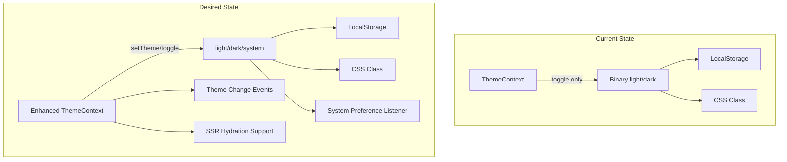
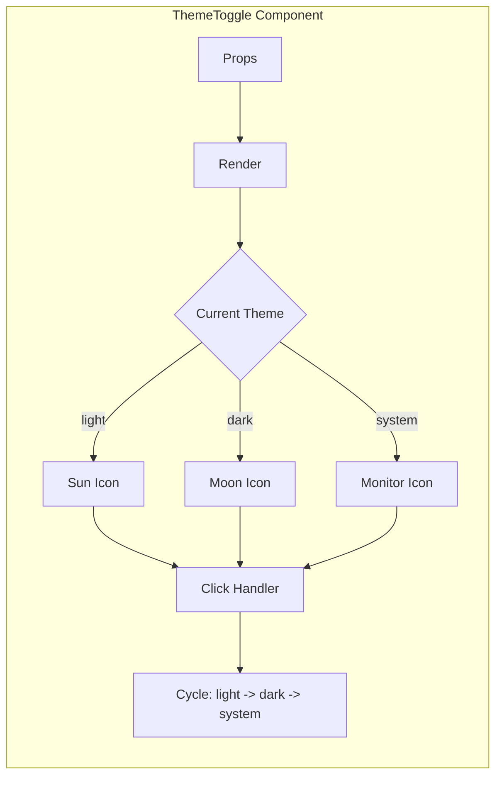

# Dark/Light Mode Architecture for NexusHealth HMS

## Executive Summary

This document outlines the architecture for implementing a comprehensive dark/light mode system in the NexusHealth HMS platform. The analysis reveals that the application already has a foundational theme implementation, but requires enhancements for a complete, polished theming experience.

---

## 1. Current State Analysis

### 1.1 ThemeContext Analysis

**File:** [`src/contexts/ThemeContext.tsx`](src/contexts/ThemeContext.tsx:1)

**Current Implementation:**
```typescript
type Theme = 'light' | 'dark';

interface ThemeContextType {
  theme: Theme;
  toggleTheme: () => void;
}
```

**Strengths:**
- ✅ LocalStorage persistence implemented
- ✅ System preference detection via `prefers-color-scheme`
- ✅ Class-based dark mode (adds/removes 'dark' class on root element)
- ✅ TypeScript types defined
- ✅ Custom hook `useTheme()` with proper error handling

**Limitations:**
- ❌ No 'system' option to dynamically follow OS preference changes
- ❌ No event listener for system preference changes after initial load
- ❌ Missing hydration handling for SSR scenarios
- ❌ No theme change callbacks/events
- ❌ Limited context API (no setTheme function for direct setting)

### 1.2 Tailwind Configuration Analysis

**File:** [`tailwind.config.js`](tailwind.config.js:1)

**Current Implementation:**
```javascript
export default {
    darkMode: 'class',
    // ... rest of config
}
```

**Strengths:**
- ✅ Class-based dark mode correctly configured
- ✅ Content paths include all component directories

**Limitations:**
- ❌ No custom color palette defined
- ❌ No dark mode specific theme extensions
- ❌ Missing semantic color tokens

### 1.3 CSS Variables Analysis

**File:** [`index.css`](index.css:1)

**Current Implementation:**
```css
:root {
  --bg-primary: #f8fafc;    /* slate-50 */
  --bg-secondary: #ffffff;   /* white */
  --text-primary: #0f172a;   /* slate-900 */
  --text-secondary: #64748b; /* slate-500 */
  --border: #e2e8f0;         /* slate-200 */
}

.dark {
  --bg-primary: #020617;    /* slate-950 */
  --bg-secondary: #1e293b;  /* slate-800 */
  --text-primary: #f1f5f9;  /* slate-100 */
  --text-secondary: #94a3b8; /* slate-400 */
  --border: #334155;        /* slate-700 */
}
```

**Strengths:**
- ✅ CSS variables defined for both themes
- ✅ Base body styles with dark mode support
- ✅ Custom scrollbar styling for dark mode
- ✅ `.glass-panel` utility class

**Limitations:**
- ❌ CSS variables not utilized in components (inline Tailwind used instead)
- ❌ Missing semantic colors (success, warning, error, info)
- ❌ Missing elevation/shadow variables
- ❌ Missing accent color variables

### 1.4 Component Dark Mode Usage

**Analysis Results:** 298 instances of `dark:` prefix found across components.

**Pattern Observed:**
```tsx
// Consistent pattern used throughout
className="bg-white dark:bg-slate-800 text-slate-900 dark:text-white"
className="border-slate-200 dark:border-slate-700"
className="bg-slate-50 dark:bg-slate-900"
```

**Strengths:**
- ✅ Extensive dark mode coverage across components
- ✅ Consistent color mapping pattern
- ✅ Sidebar has theme toggle UI
- ✅ Settings page has theme selection

**Limitations:**
- ❌ Inconsistent color values across components
- ❌ Some components may have incomplete dark mode coverage
- ❌ No centralized color tokens

---

## 2. Gap Analysis

### 2.1 Critical Gaps

| Gap | Impact | Priority |
|-----|--------|----------|
| No 'system' theme option | Users cannot auto-follow OS preference | High |
| No system preference change listener | Theme doesn't update when OS changes | High |
| Missing semantic color variables | Inconsistent status colors | Medium |
| No chart dark mode support | Charts may be unreadable in dark mode | Medium |
| No transition customization | Jarring theme switches | Low |

### 2.2 Architecture Gaps



---

## 3. Proposed Architecture

### 3.1 Enhanced ThemeContext

**New Type Definitions:**
```typescript
type ThemeMode = 'light' | 'dark' | 'system';
type ResolvedTheme = 'light' | 'dark';

interface ThemeContextType {
  // Current state
  theme: ThemeMode;           // User's preference
  resolvedTheme: ResolvedTheme; // Actual applied theme
  systemPreference: ResolvedTheme; // OS preference
  
  // Actions
  setTheme: (theme: ThemeMode) => void;
  toggleTheme: () => void;
  
  // Utilities
  isDark: boolean;
  isLight: boolean;
  isSystem: boolean;
}
```

**Implementation Features:**
1. **System Preference Detection:**
   - Initial detection via `matchMedia`
   - Event listener for preference changes
   - Cleanup on unmount

2. **LocalStorage Persistence:**
   - Key: `nexushealth-theme`
   - Value: 'light' | 'dark' | 'system'
   - Fallback to system preference if not set

3. **SSR Hydration:**
   - Suppress hydration warnings
   - Client-side theme resolution
   - Flash prevention script in `<head>`

### 3.2 Tailwind Configuration Enhancement

**Extended Color Palette:**
```javascript
// tailwind.config.js
export default {
  darkMode: 'class',
  theme: {
    extend: {
      colors: {
        // Semantic colors
        background: {
          DEFAULT: 'var(--bg-primary)',
          secondary: 'var(--bg-secondary)',
          tertiary: 'var(--bg-tertiary)',
        },
        foreground: {
          DEFAULT: 'var(--text-primary)',
          secondary: 'var(--text-secondary)',
          muted: 'var(--text-muted)',
        },
        border: {
          DEFAULT: 'var(--border)',
          muted: 'var(--border-muted)',
        },
        // Status colors with dark variants
        success: {
          light: 'var(--success-light)',
          DEFAULT: 'var(--success)',
          dark: 'var(--success-dark)',
        },
        warning: {
          light: 'var(--warning-light)',
          DEFAULT: 'var(--warning)',
          dark: 'var(--warning-dark)',
        },
        error: {
          light: 'var(--error-light)',
          DEFAULT: 'var(--error)',
          dark: 'var(--error-dark)',
        },
        info: {
          light: 'var(--info-light)',
          DEFAULT: 'var(--info)',
          dark: 'var(--info-dark)',
        },
      },
    },
  },
}
```

### 3.3 CSS Variables Strategy

**Enhanced CSS Variables:**
```css
:root {
  /* Background Colors */
  --bg-primary: #f8fafc;
  --bg-secondary: #ffffff;
  --bg-tertiary: #f1f5f9;
  --bg-elevated: #ffffff;
  
  /* Text Colors */
  --text-primary: #0f172a;
  --text-secondary: #64748b;
  --text-muted: #94a3b8;
  --text-inverse: #f8fafc;
  
  /* Border Colors */
  --border: #e2e8f0;
  --border-muted: #f1f5f9;
  --border-focus: #14b8a6;
  
  /* Status Colors */
  --success: #10b981;
  --success-light: #d1fae5;
  --success-dark: #059669;
  
  --warning: #f59e0b;
  --warning-light: #fef3c7;
  --warning-dark: #d97706;
  
  --error: #ef4444;
  --error-light: #fee2e2;
  --error-dark: #dc2626;
  
  --info: #3b82f6;
  --info-light: #dbeafe;
  --info-dark: #2563eb;
  
  /* Shadows */
  --shadow-sm: 0 1px 2px rgba(0, 0, 0, 0.05);
  --shadow-md: 0 4px 6px rgba(0, 0, 0, 0.1);
  --shadow-lg: 0 10px 15px rgba(0, 0, 0, 0.1);
  
  /* Accent */
  --accent: #14b8a6;
  --accent-light: #5eead4;
  --accent-dark: #0d9488;
}

.dark {
  /* Background Colors */
  --bg-primary: #020617;
  --bg-secondary: #0f172a;
  --bg-tertiary: #1e293b;
  --bg-elevated: #1e293b;
  
  /* Text Colors */
  --text-primary: #f1f5f9;
  --text-secondary: #94a3b8;
  --text-muted: #64748b;
  --text-inverse: #0f172a;
  
  /* Border Colors */
  --border: #334155;
  --border-muted: #1e293b;
  --border-focus: #14b8a6;
  
  /* Status Colors - Adjusted for dark mode */
  --success: #34d399;
  --success-light: rgba(52, 211, 153, 0.1);
  --success-dark: #10b981;
  
  --warning: #fbbf24;
  --warning-light: rgba(251, 191, 36, 0.1);
  --warning-dark: #f59e0b;
  
  --error: #f87171;
  --error-light: rgba(248, 113, 113, 0.1);
  --error-dark: #ef4444;
  
  --info: #60a5fa;
  --info-light: rgba(96, 165, 250, 0.1);
  --info-dark: #3b82f6;
  
  /* Shadows - Darker for dark mode */
  --shadow-sm: 0 1px 2px rgba(0, 0, 0, 0.3);
  --shadow-md: 0 4px 6px rgba(0, 0, 0, 0.4);
  --shadow-lg: 0 10px 15px rgba(0, 0, 0, 0.5);
  
  /* Accent */
  --accent: #14b8a6;
  --accent-light: #2dd4bf;
  --accent-dark: #0d9488;
}
```

### 3.4 Component Styling Approach

**Recommended Pattern:**
```tsx
// Option 1: Using CSS variables with Tailwind
<div className="bg-background text-foreground border-border">
  Content
</div>

// Option 2: Using dark: prefix (current approach)
<div className="bg-white dark:bg-slate-800 text-slate-900 dark:text-white border-slate-200 dark:border-slate-700">
  Content
</div>

// Option 3: Hybrid approach (recommended for transition)
<div className="bg-[var(--bg-primary)] text-[var(--text-primary)] border-[var(--border)]">
  Content
</div>
```

**Recommendation:** Continue using the `dark:` prefix approach for consistency with existing codebase, but introduce CSS variables for semantic colors.

---

## 4. Theme Toggle Component Design

### 4.1 Component Architecture



### 4.2 Component Props

```typescript
interface ThemeToggleProps {
  variant?: 'icon' | 'button' | 'dropdown';
  size?: 'sm' | 'md' | 'lg';
  showLabel?: boolean;
  className?: string;
}
```

### 4.3 Toggle Variants

**Icon Only (Current):**
```tsx
<button onClick={toggleTheme} className="p-2 rounded-full">
  {theme === 'dark' ? <Sun /> : <Moon />}
</button>
```

**Button with Label:**
```tsx
<button onClick={toggleTheme} className="flex items-center gap-2 px-3 py-2">
  {resolvedTheme === 'dark' ? <Sun /> : <Moon />}
  <span>{resolvedTheme === 'dark' ? 'Light Mode' : 'Dark Mode'}</span>
</button>
```

**Dropdown Selector:**
```tsx
<select value={theme} onChange={(e) => setTheme(e.target.value)}>
  <option value="light">Light</option>
  <option value="dark">Dark</option>
  <option value="system">System</option>
</select>
```

---

## 5. Charts and Visualizations

### 5.1 Chart Color Strategy

**Light Mode Chart Colors:**
```javascript
const lightChartColors = {
  primary: '#14b8a6',    // teal-500
  secondary: '#3b82f6',  // blue-500
  tertiary: '#8b5cf6',   // violet-500
  quaternary: '#f59e0b', // amber-500
  success: '#10b981',    // emerald-500
  danger: '#ef4444',     // red-500
  grid: '#e2e8f0',       // slate-200
  text: '#0f172a',       // slate-900
  background: '#ffffff', // white
};
```

**Dark Mode Chart Colors:**
```javascript
const darkChartColors = {
  primary: '#2dd4bf',    // teal-400
  secondary: '#60a5fa',  // blue-400
  tertiary: '#a78bfa',   // violet-400
  quaternary: '#fbbf24', // amber-400
  success: '#34d399',    // emerald-400
  danger: '#f87171',     // red-400
  grid: '#334155',       // slate-700
  text: '#f1f5f9',       // slate-100
  background: '#0f172a', // slate-900
};
```

### 5.2 Chart Implementation

```tsx
// Hook for chart colors
function useChartColors() {
  const { resolvedTheme } = useTheme();
  return resolvedTheme === 'dark' ? darkChartColors : lightChartColors;
}

// Usage in chart component
const colors = useChartColors();

<ResponsiveContainer>
  <AreaChart data={data}>
    <CartesianGrid strokeDasharray="3 3" stroke={colors.grid} />
    <XAxis tick={{ fill: colors.text }} />
    <YAxis tick={{ fill: colors.text }} />
    <Tooltip 
      contentStyle={{ 
        backgroundColor: colors.background,
        border: `1px solid ${colors.grid}`,
      }}
    />
    <Area fill={colors.primary} stroke={colors.primary} />
  </AreaChart>
</ResponsiveContainer>
```

---

## 6. Transition Effects

### 6.1 Theme Transition Configuration

**CSS Transitions:**
```css
/* Apply to root for smooth theme transitions */
html {
  transition: background-color 0.3s ease, color 0.3s ease;
}

/* For specific elements */
.theme-transition {
  transition: 
    background-color 0.2s ease,
    border-color 0.2s ease,
    color 0.2s ease,
    box-shadow 0.2s ease;
}
```

**Tailwind Configuration:**
```javascript
// tailwind.config.js
theme: {
  extend: {
    transitionDuration: {
      'theme': '300ms',
    },
  },
}
```

### 6.2 Transition Best Practices

1. **Avoid transitioning all properties** - Only transition color-related properties
2. **Use consistent duration** - 200-300ms for theme changes
3. **Disable transitions on page load** - Prevent flash of unstyled content
4. **Use ease timing** - `ease` or `ease-in-out` for smooth feel

---

## 7. Implementation Guidelines

### 7.1 Color Palette Reference

| Element | Light Mode | Dark Mode | CSS Variable |
|---------|------------|-----------|--------------|
| Primary Background | `#f8fafc` (slate-50) | `#020617` (slate-950) | `--bg-primary` |
| Secondary Background | `#ffffff` (white) | `#0f172a` (slate-900) | `--bg-secondary` |
| Tertiary Background | `#f1f5f9` (slate-100) | `#1e293b` (slate-800) | `--bg-tertiary` |
| Primary Text | `#0f172a` (slate-900) | `#f1f5f9` (slate-100) | `--text-primary` |
| Secondary Text | `#64748b` (slate-500) | `#94a3b8` (slate-400) | `--text-secondary` |
| Muted Text | `#94a3b8` (slate-400) | `#64748b` (slate-500) | `--text-muted` |
| Border | `#e2e8f0` (slate-200) | `#334155` (slate-700) | `--border` |
| Accent | `#14b8a6` (teal-500) | `#14b8a6` (teal-500) | `--accent` |

### 7.2 Component Dark Mode Checklist

For each component, ensure:

- [ ] Background colors have dark variants
- [ ] Text colors have dark variants
- [ ] Border colors have dark variants
- [ ] Status colors (success, warning, error) have dark variants
- [ ] Hover states work in both modes
- [ ] Focus states are visible in both modes
- [ ] Shadows are appropriate for each mode
- [ ] Icons are visible in both modes
- [ ] Form inputs are styled for both modes
- [ ] Modals and overlays work in both modes

### 7.3 Testing Strategy

1. **Visual Testing:**
   - Screenshot comparison for both themes
   - Check all major components
   - Verify transitions

2. **Functional Testing:**
   - Theme toggle works correctly
   - System preference detection works
   - LocalStorage persistence works
   - Theme persists across page reloads

3. **Accessibility Testing:**
   - Color contrast ratios meet WCAG 2.1 AA
   - Focus indicators visible in both modes
   - Screen readers announce theme changes

---

## 8. Implementation Roadmap

### Phase 1: Foundation
- [ ] Enhance ThemeContext with system preference support
- [ ] Add system preference change listener
- [ ] Implement SSR hydration support
- [ ] Add flash prevention script

### Phase 2: Design Tokens
- [ ] Define comprehensive CSS variables
- [ ] Update Tailwind configuration
- [ ] Create semantic color tokens
- [ ] Document color palette

### Phase 3: Component Updates
- [ ] Audit all components for dark mode coverage
- [ ] Update components with missing dark mode styles
- [ ] Implement chart dark mode support
- [ ] Add transition effects

### Phase 4: Polish
- [ ] Create enhanced theme toggle component
- [ ] Add theme settings to Settings page
- [ ] Implement smooth transitions
- [ ] Performance optimization

### Phase 5: Testing & Documentation
- [ ] Write unit tests for ThemeContext
- [ ] Perform visual regression testing
- [ ] Conduct accessibility audit
- [ ] Update developer documentation

---

## 9. File Changes Summary

### Files to Modify

| File | Changes |
|------|---------|
| `src/contexts/ThemeContext.tsx` | Enhanced context with system preference support |
| `tailwind.config.js` | Add color tokens and theme extensions |
| `index.css` | Expand CSS variables for both themes |
| `index.html` | Add flash prevention script |
| `components/Sidebar.tsx` | Update theme toggle UI |
| `components/Settings.tsx` | Add system theme option |

### Files to Create

| File | Purpose |
|------|---------|
| `components/ThemeToggle.tsx` | Reusable theme toggle component |
| `hooks/useChartColors.ts` | Hook for chart color theming |
| `styles/themes.css` | Optional: Separate theme variables file |

---

## 10. Conclusion

The NexusHealth HMS platform has a solid foundation for dark/light mode with the existing ThemeContext and extensive use of Tailwind's `dark:` prefix. The proposed enhancements will provide:

1. **Better User Experience:** System preference following and smooth transitions
2. **Developer Experience:** Centralized color tokens and reusable components
3. **Maintainability:** CSS variables for easy theme updates
4. **Accessibility:** Proper contrast ratios and focus states
5. **Scalability:** Easy to extend with additional themes in the future

The implementation should be done incrementally, starting with the ThemeContext enhancement, followed by design token establishment, and finally component updates.
